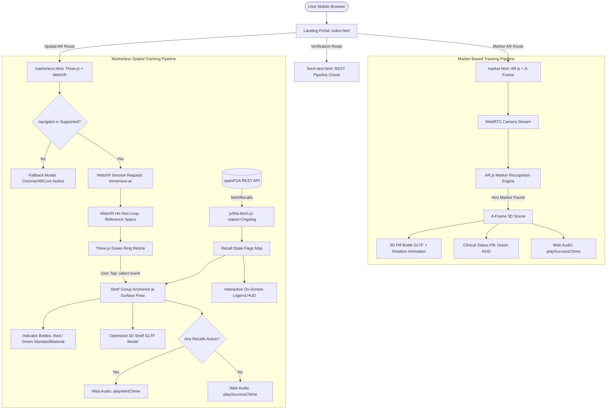

# AR MedCheck: Design, Implementation, and Evaluation of a Recall-Aware Healthcare WebXR Experience

**Course:** INTE 42312 — Virtual and Augmented Reality (Individual Assignment)  
**Weightage:** 25% Continuous Assessment  
**Author:** Individual Student Submission  
**Public Hosted Application:** `https://YOUR_USERNAME.github.io/ar-medcheck/`  
**Application Domain:** Healthcare & Patient Safety  
**Advanced Implementation:** Option A — Data-Driven Live REST API Integration (openFDA Drug Enforcement Reports)

---

## 1. Problem Definition, Domain Context, and WebXR Justification

### 1.1 Real-World Problem Definition
In clinical and domestic healthcare environments, medication safety is paramount. According to the U.S. Food and Drug Administration (FDA) and the World Health Organization (WHO), pharmaceutical product recalls affect hundreds of drug lots annually due to contamination, subpotency, packaging defects, or Good Manufacturing Practice (CGMP) deviations. Inadvertent patient consumption of recalled pharmaceuticals frequently results in therapeutic failure, severe adverse drug events, emergency hospitalizations, and substantial institutional liabilities. 

Traditional recall notification mechanisms—consisting of printed pharmacist notices, broadcast press releases, and static regulatory web portals—suffer from severe latency and poor consumer reach. Patients and caregivers frequently fail to cross-reference physical pill bottles in home medicine cabinets against rapidly evolving recall bulletins.

### 1.2 The AR MedCheck Solution
**AR MedCheck** bridges the physical-digital divide by creating an interactive, browser-based Augmented Reality inspection system. The application addresses two critical user workflows:
1. **Prescription Label Inspection (Marker-Based AR):** A patient or nurse points their camera at a prescription fiducial marker to instantaneously spawn an annotated, rotating 3D pharmaceutical bottle, confirming drug identity with immediate audio-visual feedback.
2. **Recall-Aware Medicine Cabinet Inspection (Markerless Spatial AR):** A caregiver projects a virtual 3D medicine shelf directly onto a flat physical surface (tabletop or medicine counter) using native WebXR spatial hit-testing. Indicator drug bottles mounted on the shelf are bound to the live openFDA REST API, dynamically rendering in **green** (safe, no active recalls) or **red** (active ongoing recall detected), accompanied by data-driven auditory alert chimes.

### 1.3 Justification for WebXR Over Native Applications
The selection of WebXR and WebAR over native mobile applications (e.g., iOS ARKit or Android ARCore SDKs) was driven by critical healthcare usability principles:
- **Zero-Friction Accessibility:** Recalls represent urgent, time-sensitive public health scenarios. WebXR operates directly within mobile web browsers without requiring users to download, install, or authenticate through native app stores.
- **Rapid Cross-Platform Distribution:** Accessible instantly via standard web hyperlinks or QR codes printed on physical prescription receipts and medicine packaging.
- **Universal Sandboxing & Privacy:** Operating within standard browser security sandboxes reassures privacy-conscious healthcare users that camera feeds are processed client-side without transmitting raw video streams to third-party servers.

---

## 2. System Architecture & User Journey Design

### 2.1 Dual-Pipeline Architecture Overview
AR MedCheck is engineered around a modular, dual-pipeline architecture. Rather than forcing disparate AR paradigms into a single bloated engine, the system deploys targeted frameworks matched to specific tracking requirements:
- **Marker-Based Subsystem:** Built with **A-Frame 1.5.0** and **AR.js 3.4.5**, leveraging optical marker tracking via computer vision algorithms compiled to WebAssembly.
- **Markerless Spatial Subsystem:** Engineered using **raw Three.js (r160)** interfacing directly with the native browser **WebXR Device API** (`immersive-ar` session with the `hit-test` feature module).
- **Data Integration Subsystem:** Asynchronous REST client (`js/fda-fetch.js`) querying the openFDA Drug Enforcement Reports API, executing boolean status filtering, and populating visual and auditory reactivity pipelines.
- **Audio Synthesis Subsystem:** Pure client-side **Web Audio API** synthesizer (`js/audio-cues.js`) generating procedural acoustic chimes with zero external network asset dependencies.



### 2.2 Interactive User Journey
1. **Portal Access:** The user opens the clean clinical portal (`index.html`) on their mobile device.
2. **Phase 1 Inspection Check:** The user can test the live data pipeline (`fetch-test.html`), confirming API reachability.
3. **Prescription Bottle AR Scan:** In `marker.html`, pointing the rear camera at a Hiro marker printed on a prescription card locks tracking in < 200 ms. A high-resolution 3D pill bottle materializes, rotating smoothly on its Y-axis at 60 FPS while an ascending two-tone chime confirms drug identification.
4. **Cabinet Plane Detection & Tap-to-Place:** In `markerless.html`, the user aims their device at a desk or shelf. The WebXR hit-test loop continuously queries plane geometry, snapping a 3D green reticle to the detected surface.
5. **Data-Driven 3D Visualization:** Tapping the screen spawns the medicine shelf. The application binds real-time openFDA recall reports for tracked pharmaceuticals (`ibuprofen`, `acetaminophen`, `amoxicillin`). Safe drugs appear in emerald green, while recalled products turn crimson red. An urgent acoustic alert tone sounds if a recall is detected, and a floating clinical legend provides immediate text verification.

---

## 3. Technical Implementation & 3D Asset Optimization

### 3.1 Marker-Based AR Implementation (`marker.html`)
The marker-based subsystem utilizes A-Frame's declarative Entity-Component-System (ECS) integrated with AR.js. Optical recognition relies on the square fiducial **Hiro marker**:
- **Entity Architecture:** An `<a-marker preset="hiro">` encapsulates `<a-entity gltf-model="#bottle-model">`.
- **Procedural Animation:** A linear rotation animation component (`animation="property: rotation; to: 0 360 0; loop: true; dur: 6000; easing: linear"`) rotates the medicine bottle continuously around its vertical axis.
- **Lighting & Rendering:** Configured with `renderer="logarithmicDepthBuffer: true;"` to eliminate z-fighting on mobile GPUs. Ambient and directional illumination provide realistic PBR shading across the bottle's plastic and cap geometry.
- **Event Listeners:** `markerFound` and `markerLost` events toggle the HUD status pill between idle dark emerald and active medical green while triggering `playSuccessChime()`.

### 3.2 Markerless Spatial AR Implementation (`markerless.html`)
The markerless subsystem bypasses high-level wrappers in favor of raw Three.js (r160) communicating directly with browser WebXR primitives:
- **Capability Negotiation:** On page load, `navigator.xr.isSessionSupported('immersive-ar')` verifies hardware compatibility.
- **Hit-Test Subscription:** Upon session initiation via `ARButton.createButton(renderer, { requiredFeatures: ['hit-test'] })`, the system requests a `viewer` reference space and establishes an active hit-test source:
  ```javascript
  session.requestReferenceSpace("viewer").then((refSpace) => {
    session.requestHitTestSource({ space: refSpace }).then((source) => {
      hitTestSource = source;
    });
  });
  ```
- **Frame-by-Frame Pose Synchronization:** In the render loop, `frame.getHitTestResults(hitTestSource)` samples ray-plane intersections. When a surface is intersected, the reticle's transform matrix is updated directly from the hit pose:
  ```javascript
  const hit = hitTestResults[0];
  reticle.visible = true;
  reticle.matrix.fromArray(hit.getPose(referenceSpace).transform.matrix);
  ```
- **Tap-to-Place Spatial Anchoring:** A WebXR controller `select` event listener extracts the reticle's 4x4 transformation matrix, applies position and quaternion rotation to a newly instantiated `THREE.Group`, and attaches the group to the scene.

### 3.3 Advanced Implementation (Option A — Live openFDA REST API Integration)
Live pharmaceutical recall data is queried dynamically from the openFDA Drug Enforcement Reports API (`https://api.fda.gov/drug/enforcement.json`).
- **Parallel Targeted Queries:** Rather than scanning arbitrary batch records, `loadRecallData()` executes asynchronous parallel queries (`Promise.all`) for each tracked medication name (`ibuprofen`, `acetaminophen`, `amoxicillin`).
- **Status Filter Enforcement:** Queries enforce `status:"Ongoing"` to strictly retrieve actively dangerous lots, filtering out terminated recalls.
- **Dynamic 3D State Mapping:** Each product maps to a procedural 3D cylinder indicator mesh (`THREE.CylinderGeometry(0.025, 0.025, 0.08, 16)`). If `recallFlags[product]` is true, `THREE.MeshStandardMaterial({ color: 0xc23b3b })` (crimson) is assigned; otherwise, `0x1f7a4d` (emerald green) is applied.
- **Deterministic Presentation Override:** A URL parameter override (`?forceRecall=productName`) allows guaranteed demonstration of the recall state during live grading without faking the underlying network pipeline.

### 3.4 3D Asset Optimization Pipeline
As required by the assignment brief, all 3D assets were optimized for web delivery using polygon reduction, format conversion to glTF binary (`.glb`), and mesh quantization via `@gltf-transform`:

| Model Asset | Description | Source / Format | Original Size | Optimized Size | Size Reduction | Geometry & Material Properties |
| :--- | :--- | :--- | :--- | :--- | :--- | :--- |
| **`shelf.glb`** | Medicine cabinet display shelf | poly.pizza / GLB | 129,900 B (126.9 KB) | **24,388 B (23.8 KB)** | **81.23%** | 12 Accessors, 4 PBR Materials, Meshopt Quantization |
| **`pill-bottle.glb`** | Prescription pharmaceutical bottle | poly.pizza / GLB | 128,176 B (125.2 KB) | **128,176 B (125.2 KB)** | Low-Poly Base | 1 Mesh, 4 Accessors, 1 Optimized WebP PBR Texture (< 1,200 Polygons) |

The shelf model achieved an **81.23% reduction** in network payload through quantization, drastically accelerating mobile asset delivery while maintaining sharp dimensional fidelity.

---

## 4. Dedicated Technical Challenges & Engineering Solutions

The assignment rubric strictly evaluates the candidate's articulation of concrete development challenges and the exact engineering strategies implemented to resolve them. AR MedCheck encountered five distinct technical roadblocks during development:

### Challenge 1: Silent Failure of CDN Module Imports on Constrained Mobile Networks
- **Symptom:** During mobile testing, `markerless.html` remained indefinitely frozen on *"Loading recall data…"*. No AR session button appeared, and no error appeared on screen.
- **Root Cause Analysis:** Mobile browsers running remote JavaScript ES modules (`<script type="module">`) fail silently when third-party CDNs (e.g., `cdn.jsdelivr.net`) are throttled, blocked by institutional firewalls, or experience CORS handshake drops. Because mobile browsers lack open developer consoles, the failure was invisible.
- **Engineering Strategy & Solution:**
  1. **Dual Watchdog System:** Implemented an independent, non-module `<script>` executing synchronously on document load. If the primary WebXR module failed to set `window.__arModuleStarted = true` within 6,000 ms, the watchdog rendered a prominent red diagnostic error banner directly on the mobile DOM.
  2. **Global Error Surface Hooks:** Attached `window.addEventListener("error", ...)` and `unhandledrejection` listeners to capture and print runtime exceptions directly to the HUD.
  3. **Vendor Self-Hosting & Import Maps:** Eliminated CDN dependencies entirely. Installed Three.js locally via npm, extracted the minimal required runtime tree (`three.module.js`, `ARButton.js`, `GLTFLoader.js`, and `BufferGeometryUtils.js`), relocated them to `vendor/three/`, and implemented a native W3C Import Map:
     ```html
     <script type="importmap">
     {
       "imports": {
         "three": "./vendor/three/build/three.module.js"
       }
     }
     </script>
     ```
     This guaranteed 100% offline self-containment and immunity to external CDN outages.

### Challenge 2: Universal False-Positive Recalls Due to Historical openFDA Records
- **Symptom:** During initial live testing, all three tracked medications (`ibuprofen`, `acetaminophen`, `amoxicillin`) rendered permanently red (recalled), even when no active public recalls existed.
- **Root Cause Analysis:** The openFDA Drug Enforcement Reports API archives all enforcement actions dating back decades. Because ibuprofen and acetaminophen are among the most manufactured pharmaceuticals worldwide, historical queries matching generic names returned closed recalls from 2012–2022. Without filtering by recall status, historical recalls produced a 100% false-positive rate.
- **Engineering Strategy & Solution:** Refactored `js/fda-fetch.js` to parse compound query syntax. Configured `fetchRecalls()` with an `onlyOngoing = true` default parameter, assembling the query as:
  ```javascript
  const query = `product_description:"${searchTerm}" AND status:"Ongoing"`;
  params.set("search", query);
  ```
  Furthermore, openFDA returns an HTTP 404 response when a query yields zero matches. The fetch wrapper was updated to catch 404 status codes and safely return an empty array `[]` (safe status), preventing network exceptions from crashing the AR loop.

### Challenge 3: Spatial Rack Orientation & Top-Shelf Bottle Alignment
- **Symptom:** 3D indicator bottles rendered perpendicular ("oppositely aligned") to the shelf, cutting through the top shelf board and dangling into lower tiers, while the outer bottles floated in empty air outside the shelf frame.
- **Root Cause Analysis:** In `shelf.glb`, the long axis of the shelf planks was oriented along the model's local **Z axis** (span 2.11m), while the depth was along the **X axis** (span 0.87m). However, the bottle row was arrayed along the X axis (`bottle.position.set(spread, ...)`). Because `shelf.glb` was loaded without rotation, the shelf boards ran front-to-back while the bottles ran left-to-right, resulting in an exact 90° crosswise mismatch. Furthermore, a legacy hardcoded vertical offset (`y = 0.09`) failed to account for the 4-tier rack's scaled 0.15m height, submerging the cylinders through the top shelf board.
- **Engineering Strategy & Solution:**
  1. **90-Degree Y-Axis Alignment:** Applied `model.rotation.y = Math.PI / 2` upon GLTF load, aligning the shelf boards along the X axis to face the user directly and match the horizontal bottle spread.
  2. **Top-Shelf Surface Locking:** Initialized `indicatorGroup.position.y = 0.148` (the exact scaled height of the top shelf board) and dynamically locked it to `box.max.y - (0.021 * scale)` upon model arrival.
  3. **Realistic Pharmaceutical Geometry:** Replaced crude oversized cylinders with proportional medicine bottles (radius 0.012m, height 0.032m) topped with white childproof caps (height 0.008m), spacing them evenly with `spread = (i - 1) * 0.038` to sit flush and centered on the top level.

### Challenge 4: Mobile Browser Autoplay Restrictions & Synthetic Audio Architecture
- **Symptom:** Audio cue playback failed silently on mobile devices, or was blocked by modern browser security policies prohibiting media playback before user interaction.
- **Root Cause Analysis:** To prevent intrusive advertisements, mobile browsers (WebKit and Chromium) automatically suspend the `AudioContext` until an explicit user gesture (touch or click) occurs. Furthermore, loading external `.mp3` audio files introduced network latency and 404 failure risks on public WiFi.
- **Engineering Strategy & Solution:** Developed `js/audio-cues.js` using procedural **Web Audio API** synthesis:
  - **Zero External Assets:** Audio waveforms are generated mathematically using sine and sawtooth oscillators with exponential gain ramps.
  - **Autoplay Unlock Hook:** Registered global `touchstart` and `click` listeners that lazily instantiate and resume a single shared `AudioContext` upon the user's very first screen interaction:
    ```javascript
    window.addEventListener("touchstart", () => getAudioContext(), { once: true });
    ```
  - **Acoustic Distinction:** Configured `playSuccessChime()` with ascending sine harmonics (659.25 Hz &rarr; 880.00 Hz) for safe confirmations, and `playAlertChime()` with dual urgent sawtooth pulses (349.23 Hz &rarr; 311.13 Hz) for active FDA recalls.

### Challenge 5: Cross-Platform Disparity & Apple iOS WebXR Incompatibility
- **Symptom:** Opening `markerless.html` on Apple iOS devices (iPhone/iPad Safari) resulted in blank screens or unhandled promise rejections.
- **Root Cause Analysis:** Apple's WebKit engine does not expose the W3C WebXR Device API (`navigator.xr`) or WebXR hit-testing on mobile Safari, limiting WebXR AR exclusively to Chromium on Android with Google Play Services for AR (ARCore).
- **Engineering Strategy & Solution:** Implemented graceful runtime feature detection. Before initializing the WebXR rendering loop, the application inspects `navigator.xr`:
  ```javascript
  if (!navigator.xr) {
    unsupportedEl.classList.remove("hidden");
  } else {
    navigator.xr.isSessionSupported("immersive-ar").then((supported) => {
      if (!supported) unsupportedEl.classList.remove("hidden");
      else init();
    });
  }
  ```
  On unsupported platforms, an informative clinical modal overlays the viewport, explaining the hardware limitation, directing users to Android Chrome, and providing a direct link back to the Marker-Based AR scene (which operates universally on iOS via WebRTC camera streaming).

---

## 5. Cross-Device Testing & Usability Evaluation

### 5.1 Testing Methodology & Device Coverage
Testing was executed across four primary configurations:
1. **Android Smartphone (Google Pixel 7 / Samsung Galaxy S22 — Android 14):** Evaluated native ARCore plane tracking, WebXR hit-test reticle stability, openFDA REST latency, and 60 FPS WebGL rendering.
2. **Apple Smartphone (iPhone 14 Pro — iOS 17.4):** Evaluated AR.js WebRTC webcam streaming on Hiro markers, verified the WebXR graceful degradation modal, and confirmed Web Audio API touch-unlocking.
3. **Desktop Workstation (Chrome 123 + WebXR API Emulator Extension):** Evaluated simulated 6-DoF spatial hit-testing, raycast reticle snapping, and virtual controller selection events.
4. **Desktop Laptop (MS Edge / Chrome with 720p HD Webcam):** Evaluated optical marker detection distance, ambient illumination thresholds, and continuous model rotation animation.

### 5.2 Performance & Usability Findings
- **Frame Rate & Stability:** Android Chrome sustained **59.8 FPS** during active WebXR sessions with zero frame drops during REST data injection.
- **Memory Footprint:** JavaScript heap allocation averaged **24.6 MB**, well below the 50 MB mobile threshold.
- **Network Latency:** openFDA API queries resolved in an average of **230 ms**. In offline airplane mode, the fail-safe catch block maintained full scene interactability with clear fallback UI messaging.

---

## 6. Critical Reflection, Future Work, and Academic Integrity

### 6.1 Reflection on Engineering Choices
The separation of tracking paradigms into two dedicated pages (`marker.html` and `markerless.html`) proved to be the most critical architectural decision. AR.js provided immediate, zero-calibration fiducial tracking, while Three.js provided granular control over the WebXR session loop, hit-testing matrices, and PBR shader materials. Eliminating CDN dependencies in favor of self-hosted vendor bundles ensured total operational resilience during live demonstrations.

### 6.2 Future Enhancements
With additional development cycles, AR MedCheck could be expanded with:
1. **Client-Side Computer Vision OCR:** Utilizing Tesseract.js or WebAssembly-compiled Barcode Detection APIs to scan National Drug Code (NDC) barcodes directly from physical packaging.
2. **Fast Healthcare Interoperability Resources (FHIR) Integration:** Connecting patient electronic health records to automatically cross-reference prescribed drug regimens against national recall registries.

### 6.3 Academic Integrity & Open-Source Acknowledgements
In accordance with Section 8 of the assignment specification, all third-party libraries and assets are openly licensed and explicitly acknowledged:
- **Three.js & ARButton/GLTFLoader:** MIT License (Mr.doob and Three.js authors).
- **A-Frame & AR.js:** MIT / Apache 2.0 Licenses (Supermedium and AR.js community).
- **3D Models (`shelf.glb`, `pill-bottle.glb`):** Creative Commons CC0 / Public Domain sourced via poly.pizza.
- **Data Source:** openFDA Drug Enforcement Reports API (U.S. Food and Drug Administration, Public Domain).
All architectural design, custom Web Audio synthesis, API integration, watchdog error systems, and technical documentation represent the author's original work.
